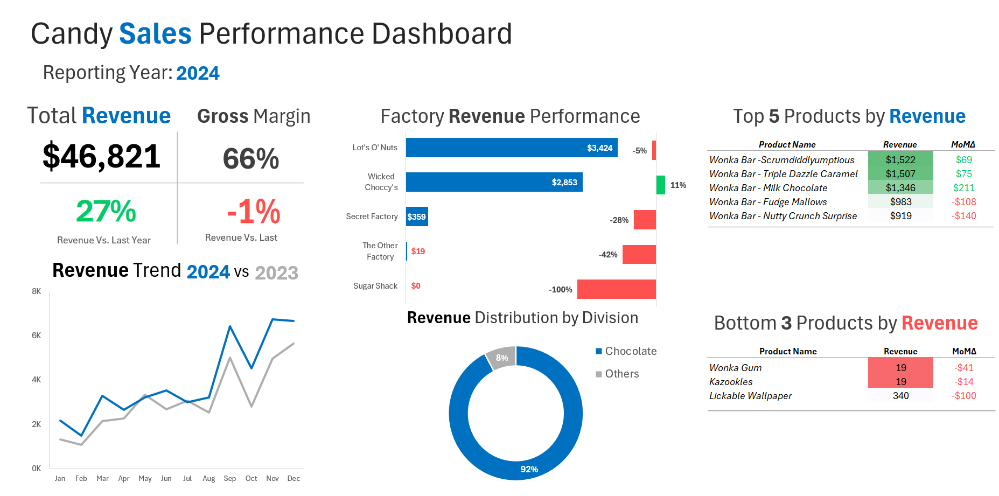
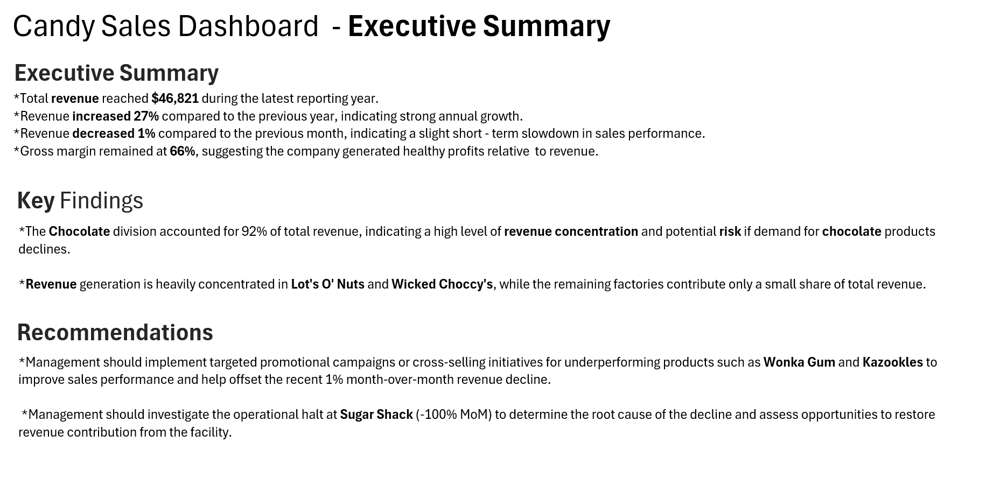

Candy Sales Performance Dashboard
Project Overview

This project analyzes candy sales performance using a dynamic Excel dashboard built from a dataset containing 10,195 sales records. The dashboard provides a business-focused view of revenue performance, factory performance, product performance, and revenue concentration through KPI reporting and MoM/YoY comparisons.

 Dataset

- 10,195 sales records
- Industry: Consumer Goods / Candy Sales

DASHBOARD PREVIEW

 Tools Used

- Excel
- Power Query
- PivotTables (Exploratory Analysis)
- SUMIFS
- MAXIFS
- IF / Nested IF
- FILTER
- SORTBY
- TAKE
- CHOOSECOLS
- Conditional Formatting

Key Findings

Revenue Concentration by Division
The Chocolate division accounted for 92% of total revenue, indicating a high level of revenue concentration and potential risk if demand for chocolate products declines.

Revenue Concentration by Factory
Revenue generation is heavily concentrated in Lot's O' Nuts and Wicked Choccy's, while the remaining factories contribute only a small share of total revenue.

Recommendations

Product Performance Improvement
Management should implement targeted promotional campaigns or cross-selling initiatives for underperforming products such as Wonka Gum and Kazookles to improve sales performance and help offset the recent 1% month-over-month revenue decline.

Factory Performance Investigation
Management should investigate the operational halt at Sugar Shack (-100% MoM) to determine the root cause of the decline and assess opportunities to restore revenue contribution from the facility.

INSIGHTS PREVIEW

